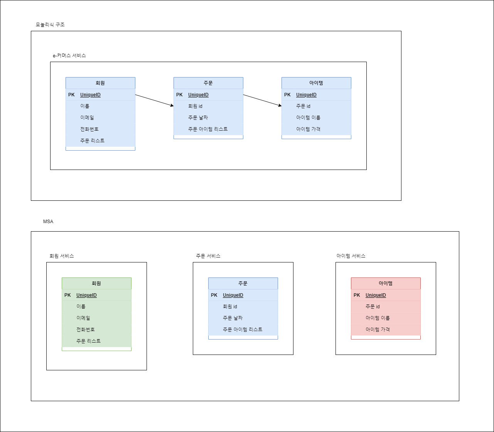
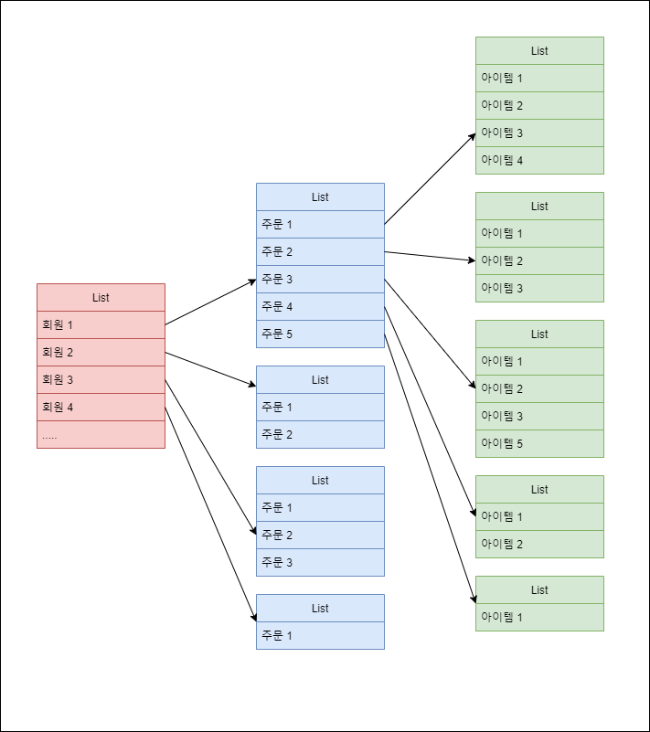

# MSA에서의 데이터 연관관계

## MSA에서 서비스 분리에 따른 데이터 연관관계 해결 및 팁

### MSA 구조와 서비스 구성

MSA에서 관리하는 데이터에 대해서 어떻게 저장 하고 관리할것인가에 대해 고민해본다.  

- 모놀리식 구조와 MSA구조에서의 데이터 관계를 비교한 그림 및 상황  
    - 모놀리식 구조에서는 서비스에서 DB를 한개만 사용한다고 고려한다.  
        - 각각의 테이블은 연관관계로 구성되어있으며다.  
- MSA에서는 각 서비스마다 서로다른 DB를 각자 사용한다고 가정한다.  
    - 각각의 테이블은 외래키를 통해 참조관계에 있다.  
    - DDD 시에 Aggregate단위로 도메인을 구성할때 주문과 아이템을 같은 단위로 묶을수도 있음  
    - 명확한 상황을 확인 하기 위해 분리되었다고 가정  

데이터 및 서비스 구조는 다음과 같다.

### 응답 데이터

또한 이러한 구조의 데이터를 응답 값으로 줘야한다고 가정한다.  

조회 조건은 다음이라고 가정한다. (ex. 가입 날짜가 2023년인 모든 회원 조회)  

### 서비스 분리에 따른 데이터 연관관계 문제 해결 과정

- 모놀리식 구조  
    - 하나의 서비스에서 조회는 최소 3번 필요(N+1문제가 발생하지 않았다고 전제함)하며, 이를 데이터간의 연관관계를 통해 해결이 가능하다.  
    - 각각의 연관관계에 해당하는 값은 orm 에서 자동으로 매칭 해주며, 연관관계 설정 및 조회 로직은 조건에 맞게 커스텀하게 구성한다. (ex. 가입 날짜 기준으로 해당되는 모든 회원 조회)  
        - 회원 리스트 조회 (예시 처럼 가입 날짜 기준으로 해당되는 모든 회원 조회)  
            - 회원 리스트 조회시 주문과의 연관관계 존재  
        - 연관된 주문 리스트 조회  
            - 조문 리스트 조회시 아이템과의 연관관계 존재  
        - 아이템 조회  
            - 아이템 리스트 조회  
        - 주문에 연관관계를 맺고 있는 아이템 리스트를 설정  
            - 아이템 테이블에는 주문 id를 왜래키로 가지고 있으며, 이를 통해 주문에 대당하는 아이템으로 매칭 한다.
        - 회원에 연관관계를 맺고 있는 주문 리스트를 설정  
            - 주문 테이블에는 회원 id를 외래키로 가지고 있으며, 이를 통해 회원이 주문한 리스트를 매칭한다.  
        - 응답 데이터 완성 및 응답  
    - 장애 요소  
        - 연관관계로 묶인 데이터들 조회시 슬로우 쿼리 및 오류 발생시 전체에 영향을 끼침  
        - 단일 서비스이므로, 응답 자체를 주지 못하는 경우 발생  
    - 페이징 처리  
        - 최상위 회원에 대한 페이징 처리만 진행하면, orm이 나머지 해당되는 데이터만 조회하므로 로직이 간단해짐  
        - 하위 엔티티에 대한 페이징 처리 역시 간단  
            - ex) 가입 날짜가 2023년인 모든 회원을 조회 하는데, 회원당 주문은 주문 날짜를 최신으로 정렬하고 최대 10건 까지만 조회한다.  
            - orm 로직이 복잡해지긴 조건 추가로 인한 비즈니스 로직이 추가되지는 않는다.
- MSA 구조  
    - 서비스에 중복된 데이터를 저장하지 않는 경우   
        - 데이터를 가지고 있는 서비스들은 각각 조건에 맞는 1번의 조회를 통해 데이터를   
            - 회원 서비스는 회원을 조회 (예시 처럼 가입 날짜 기준으로 해당되는 모든 회원 조회)  
                - 이때 조회된 회원들의 id를 모아서 주문 서비스에 주문 조회 요청을 전송한다.  
            - 주문 서비스 조회 (위에서 요청 받은 회원들의 id에 해당되는 주문을 전부 조회)  
                - 조회된 주문들의 아이템 id를 모아서 아이템 서비스에 아이템 조회 요청을 전송한다.  
            - 아이템 서비스 조회  
                - 조회된 아이템들을 주문 서비스로 전달한다.  
            - 주문 서비스에서 아이템 서비스로부터 응답을 받은 경우  
                - 아이템을 각각의 주문에 해당되는 값으로 매칭 해서 회원 서비스로 전달한다.  
            - 회원 서비스에서 주문 서비스로부터 응답을 받은 경우  
                - 주문과 아이템이 매칭된 결과를 받았으므로, 회원과 주문 매칭을 진행한다.  
            - 응답 데이터 완성 및 응답  
    - 장애 요소  
        - 1*N 문제 발생 (1대다 데이터 연관관계에서의 N+1과 비슷하나 조금 다름)  
            - 하위 데이터 조회시 id를 모아서 주문을 조회를 하지 않고, id 단건으로 조회 요청을 전송하게되면 회원 조회 (1번) 회원의 주문 갯수 조회(N번)의 곱만큼의 추가 조회가 발생한다.  
                - 아이템 까지 단건으로 요청하면 아이템 갯수 까지 곱해야 해서 총 1*N*M개의 요청이 발생한다.  
                - 따라서 조건에 해당되는 모든 데이터를 한번에 조회 하고 매칭 해주도록 해야한다..  
                    - 이는 JPA의 영속성 콘텍스트와 동일한 기능으로 동작한다고 볼수있다.  
                    - 영속성 콘텍스트를 구현한다고 생각하면 될것같음.  
        - 서비스간의 내부 통신간 장애 발생  
            - 서킷 브레이커를 통해 해결이 가능하나, 사용자에게 전달되는 데이터가 온전하지 못한 경우 발생  
                - 응답 자체는 전달해주었으므로, 부분적인 장애 발생  
    - 페이징 처리  
        - 최상위 회원에 대한 페이징 처리  
            - orm의 도움을 전부 받을수 없어 비즈니스 로직에서 매칭 처리를 해야된다.  
            - 다만, 최상위에 대한 처리만 해주면 되고, 나머지는 조회 시점에 이미 필터링 되어있다.  
        - 하위 엔티티에 대한 페이징 처리  
            - 역시 orm의 도움을 전부 받을수 없으며, 하위 엔티티 조회후 매칭시 비즈니스 로직단에서 매칭 처리를 해야한다.  
            - ex) 가입 날짜가 2023년인 모든 회원을 조회 하는데, 회원당 주문은 주문 날짜를 최신으로 정렬하고 최대 10건 까지만 조회한다.  
            - 회원과 주문간의 매칭은 간단해질수도 있으나, 주문과 아이템 관계에 페이징 처리를 역시나 비즈니스 로직단에서 수행해주어야 한다.  
    - 서비스에 중복된 데이터를 저장하는 경우  
        - MSA는 트래픽 증가에 따른 컴퓨팅 파워가 보장된 상태여야 한다.  
            - 트래픽 증가에 대한 대응 방안으로 언제든 스케일업이 가능해야 한다.  
                - 모놀리식 구조에서는 정해진 리소스로 최대의 효율을 내기 위해 정규화 및 중복 데이터를 최소화 한다.  
                - MSA 구조에서는 리소스를 조금 더 사용하더라도 최소의 장애 발생과 최적의 성능을 위한 중복 데이터를 허용한다.  
                    - 따라서 중복된 데이터가 있더라도 최대의 성능 및 장애 발생이 줄어든다면, Trade-off 가능한 상태이다.  
        - 데이터 중복 저장되는 경우  
            - 멤버 서비스에 주문 서비스 중복 저장  
            - 주문 서비스에 멤버 데이터 중복 저장  
            - 주문 서비스에 아이템 데이터 중복 저장  
        - 조회 방법 자체는 모놀리식 구조와 다름 없으므로, 상세 과정은 생략 하도록한다.  
        - 문제  
            - 데이터를 두번 저장 해야되는 경우가 발생한다.  
                - 신규 회원이 회원 가입을 진행한 경우  
                    - 회원 서비스에 데이터 베이스에도 정보가 저장되어야하고, 주문 서비스에도 회원의 정보가 저장되어야한다.  
                - 신규 주문이 생성된 경우  
                    - 주문 서비스에 신규 주문을 저장 되어야하고, 아이템 서비스에도 주문 서비스가 저장되어야 한다.  
                - 이때 하나의 테이블에는 저장이 성공하였고, 다른 데이터 베이스에는 저장이 실패하는 경우 무결성을 보장해야한다.  
                    - 조회의 문제는 해결하였지만, 무결성을 위한 추가 로직이 또 발생하고, 엔티티가 변경되는 경우 이러한 추가적인 부분까지 전부 변경이 되어야한다.  
                    - 주문 테이블에서 저장된 아이템 조회 자체가 실패가 나는 경우는 아예 아이템 서비스로 조회 하도록 하면 된다.  
                        - 문제는 또 발생한다. 주문 테이블에는 주문3에 해당하는 아이템이 3개 저장되어있고, 아이템 서비스에는 주문3에 해당되는 아이템이 4개가 저장되어있는 경우가 발생한다.  
            - 데이터 무결성 보장  
                - 무결성을 보장 하기 위해 스케줄링을 돌면서 두개의 디비를 동기화 하는 방법  
                    - 스케줄링 자체가 실패하는 경우 문제는 또 발생한다.  
    - Aggregate단위로 잘묶는 경우  
        - 실무에서 도메인은 복잡하고 여러 요소가 같이 혼재되어있을수 있다.  
        - 예시는 회원 주문 밖에 없지만, 다수개의 도메인이 같이 조합 되어야 하는 경우 아무리 Aggregate 단위로 잘묶었다고 하더라도 위와 같은 상황은 반드시 발생한다.  
        - 또한 중복된 데이터를 저장하면, 매칭로직, 즉 비즈니스 로직의 부담을 줄여줄수는 있겠지만, 어느까지나 횟수를 줄이는것이지, 발생 자체를 막을수없다.  
            - 모든데이터가 중복되어 저장되는 경우는 모놀리식 구조가 여러개 분산되어있는 분산처리 환경이지, MSA 환경이 아니다.  
- 결론  
    - 도메인을 Aggregate단위로 구성시 잘 구성하는것도 중요하지만, 결국 데이터를 서로 다른것을 쓰게되면 피할수 없는 문제라고 생각한다.  
    - 따라서 복잡성을 최소화 할수있는 단위로 구성을 잘하고, 필요에 의하면 중복 데이터도 허용을 하되, 결국후에 발생하는 문제를 잘처리하는게 중요하다.  
        - 물론 영원한것은 없으므로, 변경에도 유연하게 대처 하도록 시나리오를 잘 구성하여 빠르고 올바른 Best-practice를 고민 해보아야한다.  
    - 가장 중요한 서비스의 특성을 확인 해야한다.  
        - 다수의 상위와 그 하위의 데이터까지 전부 보여 주어야 하는 경우는 생각보다 적다.  
            - 최근의 서비스들은 사용자 특성에 맞는 데이터를 노출 시키는 경우가 많기 때문이다.  
        - 예를 들어 피드를 구성한다고 고려했을때 피드에 하위의 모든 데이터를 사용자에게 노출 시키지 않고 상데이터의 중요한 정보만 일부 제공한다.  
            - 상세 정보로 들어가는 경우에 하위 데이터가 모두 필요하겠지만, 이때 상위 데이터가 1개이므로 하위 데이터를 가져오는 과정은 생각보다 간단해진다.  
        - 전체 데이터를 조회하는 경우가 빈번하게 발생하는 경우는 어드민 페이지 정도가 있을것같다.  